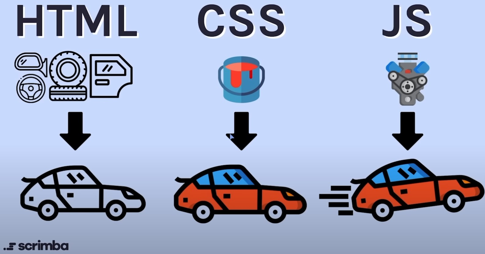

### Tutorials
+ https://www.w3schools.com/html/default.asp
+ https://developer.mozilla.org/en-US/docs/Learn/Getting_started_with_the_web
+ https://developer.mozilla.org/en-US/docs/Learn/HTML/Introduction_to_HTML
+ 1 - as first https://www.youtube.com/watch?v=a_iQb1lnAEQ
+ https://www.youtube.com/watch?v=qz0aGYrrlhU

# HTML - Hyper Markup Language
1. 
2. An HTML file can be opened by dropping it onto a web browser.
3.  HTML Tags - tag list: https://www.w3schools.com/TAGs/.  
The website is built from various elements. For a given element to work, we invoke it by opening it `"<TAG>"` and close `"</TAG>"` appropriate TAG. Some tags are self-closing.
4. `<!DOCTYPE HTML>` - every project should start with a document type declaration and `<html> </html>` and be closed with `</html>`
5. `<body> </body>` - is the visible part of the page that is located in **body**
6. `<header> </header>`- (headings) - from h1 (largest) to h6 (smallest). The `<header>` element represents a container for introductory content or a set of navigational links. Typical content: headings, logo/icon, authorship information. There can be many paragraphs in one HTML. But NO `<header>` is allowed in `<footer>`, `<address>` or another `<header>`
7. `<p> </p>` - paragraph
8. [``](https://www.w3schools.com/TAGs/tag_img.asp) - to embed an image, self-closing. `` tag has two required attributes:
    + `src` (source) - Specifies the path to the image
    + good to specify width and height, if not page might flicker during image loads.
    + `alt` - Specifies an alternate text for the image, if the image for some reason cannot be displayed.    
    
    Example: ``
9. [`<div>` `</div>`](https://www.w3schools.com/TAGs/tag_div.asp) (divider)- we use it for **nesting**. It is used as a container for section of code. Any kind of content can be put in `<div>`. It is useful for CSS and JS. By definition, browser are placing line break before and after `<div>`. The default display as a `block`. 
10. [`<buton></buttom>`](https://www.w3schools.com/TAGs/tag_button.asp) - defines clickable button.  **Specify the `type` attribute for a `<button>`**.  
Types of `<button>`:
    + `button`
    + `submit`
    + `reset`   
    
    You can put inside text and tags like: `<i>`, `<b>`, `<strong>`, `<br>`, `` etc. *This is not possible with the `<input>`*.
11. [`<input>`](https://www.w3schools.com/TAGs/tag_input.asp) - self-closing. Specifies where user can enter data. The `<input>` element can be displayed in many ways, depending on the attribute.  
The different input [`types`](https://www.w3schools.com/TAGs/att_input_type.asp) are as follows:
    + `<input type="button">` <input type="button">
    + `<input type="checkbox">`<input type="checkbox"> with `<label>`
    + `<input type="color">`<input type="color"> with `<label>`
    + `<input type="date">`<input type="date"> with `<label>`
    + `<input type="datetime-local">`<input type="datetime-local"> with `<label>`
    + `<input type="email">`<input type="email"> with `<label>`
    + `<input type="file">`<input type="file"> with `<label>`
    + `<input type="hidden">` <input type="hidden">
    + `<input type="image">` <input type="image">
    + `<input type="month">`<input type="month"> with `<label>`
    + `<input type="number">`<input type="number"> with `<label>`
    + `<input type="password">`<input type="password"> with `<label>`
    + `<input type="radio">`<input type="radio"> with `<label>`
    + `<input type="range">`<input type="range"> with `<label>`
    + `<input type="reset">` <input type="reset">
    + `<input type="search">`<input type="search"> with `<label>`
    + `<input type="submit">` <input type="submit">
    + `<input type="tel">`<input type="tel"> with `<label>`
    + `input type="text">` (default value)<input type="text"> with `<label>`
    + `<input type="time">`<input type="time"> with `<label>`
    + `<input type="url">`<input type="url"> with `<label>`
    + `<input type="week">`<input type="week"> with `<label>`
12. [`<label></label>`](https://www.w3schools.com/TAGs/tag_label.asp) - kind of declaring what particular element is doing. It must be same to the `id` of the related element to bind them together. Label also can be bound together with element by placing element inside label. 
13. [`<br>`](https://www.w3schools.com/TAGs/tag_br.asp) - self-closing, insert single line break
14. [`<aside></aside>`](https://www.w3schools.com/TAGS/tag_aside.asp) - when you want to put some content aside, but related to prime content. `<aside>` is often placed as a sidebar in document.
15. [`<a></a>`](https://www.w3schools.com/TAGs/tag_a.asp) - anchor tag, it defines a hyperlink to another page. Very important attribute of the `<a>` is [`href`](https://www.w3schools.com/tags/att_a_href.asp), witch indicates the link destination. `<a>` will be only a placeholder for link if there is no `href`(hypertext reference). Important attribute of `<a>` tag is attribute [`target`](https://www.w3schools.com/tags/att_a_target.asp). It specifies how to open link. List of options below:
    + `_blank` - opens linked document in a new window or tab.
    + `_self` - opens the linked document in the same frame as it was clicked (this is default)
    + `_parent` - opens the linked document in the parent frame
    + `_top` - opens the linked document in the full body of the window
    + `framename` - Opens the linked document in the named iframe. 
    
    Example: `<a href="https://www.w3schools.com" target="_blank">Visit W3Schools</a>`
16. [HTML structure](https://www.w3docs.com/snippets/html/html5-page-structure.html) - 
``` html
<!DOCTYPE html> **Document Type Declaration**
<html lang="en"> **This element tells browser, that it is html. lang attribute is nowadays unnecessary**
    <head> **This element contains metadata (document title, character set, styles, links, scripts), specific information about the web page that is not displayed to the user**
        <title>Google clone</title>
        <meta http-equiv="Content-Type" content="text/html; charset=UTF-8"/>
        <meta name="Martin" content="google">
        <link rel="stylesheet" href="styles.css">
    </head>
    <body> **The <body> of a document contains the content of the document. The content may be presented by a user agent in different ways. E.g., the content can be text, images, links, colors, graphics, etc.**
        
        <input type="text">
        <button>Google Search</button>
        <button>I'm Feeling Lucky</button>
        <p>We protect your privacy. <a href="blog.html">Learn how.</a></p>
    </body>
</html>
```
17. [Lists](https://www.w3schools.com/HTML/html_lists.asp) - we can create different type of lists.
    + [`<ul></ul>`](https://www.w3schools.com/TAGs/tag_ul.asp) - Unordered list, will be marked with bullets by default.
        + [`<li></li>`](https://www.w3schools.com/TAGs/tag_li.asp) - for each list item
    + [`<ol></ol>`](https://www.w3schools.com/TAGs/tag_ol.asp) - Ordered list, will be marked with numbers by default. It can be changed. Order, kind and specific start value can be changed.
        + `reversed` - list order will be reversed (3,2,1)
        + `start` - on what value order starts
        + `type` - what kind of marker to use in the list
            + `1` - Decimal numbers (Default)
            + `a` - Alphabetical order list, lowercase (a, b, c)
            + `A` - Alphabetical order list, uppercase (A, B, C)
            + `i` - Roman number, lowercase (i, ii, iii)
            + `I` - Roman number, uppercase (I, II, III)
        + `<li></li>` - for each list item
    + [`<dl></dl>`](https://www.w3schools.com/TAGs/tag_dl.asp) - Description list
        + [`<dt></dt>`](https://www.w3schools.com/TAGs/tag_dt.asp) - defines the term (name)
        + [`<dd></dd>`](https://www.w3schools.com/TAGs/tag_dd.asp) - describes each term