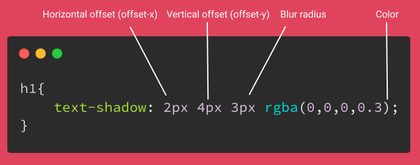

# CSS

1. [CSS](https://www.w3schools.com/css/css_intro.asp) - Cascading Style Sheets - it describes how HTML elements are to be displayed on screen, appear, or in other media. It can control multiple web pages at once. It can be implemented in HTML document itself or in external stylesheet file - `styles.css`
2. [CSS syntax](https://www.w3schools.com/css/css_syntax.asp) - 
**SELECTOR** - points the element you want to style. It can be: body, header, paragraph.  
**DECLARATION BLOCK** - contains 1 or more declarations separated by semicolon - `;`. Each declaration contains properties name and value, separated by colon - `:`.  
Multiple CSS declarations are separated with semicolons, and declaration blocks are surrounded by curly braces - `{}`. 
3. ***`/*...*/`*** - this is how you make comments in CSS document.
4. [Adding CSS to HTML](https://www.w3schools.com/CSS/css_howto.asp) - we have 3 ways to insert CSS:
    + **external CSS** - with external style sheet, you can change the look of an entire website by changing just one file. Each HTML page must include the `<link>` to style sheet. It should *not contain any HTML tags*. 
    + **Internal CSS** - it can be used if one single HTML page should have unique style. You use [`<style></style>`](https://www.w3schools.com/TAGs/tag_style.asp) tag in `<head>` element. 
    + **Inline CSS** - to apply a unique style for single element. *An inline style loses many of the advantages of a style sheet (by mixing content with presentation). Use this method sparingly*. 
5. [**Priority order**](https://vecta.io/blog/definitive-guide-to-css-styling-order) - when there are more styles used.  

    ***Lex specialis derogat legi generali***  
    General rules:
     + inline CSS (HTML style attribute) overrides CSS rules in style tag and CSS file 
     + a more specific selector takes precedence over a less specific one
    + rules that appear later in the code override earlier rules if both have the same specificity. 
    + A CSS rule with `!important` always takes precedence.
6. [`display`](https://developer.mozilla.org/en-US/docs/Web/CSS/display) - it is used to change display behavior of HTML element. Mainly we have 2:
    + `block` - **always** starts on new line and take the full width available (stretches out to the left and right as far as it can).
    + `inline` - only takes as much width as necessary. *It does not start a new line*.
    
    There are more `display` values.
7. [***shorthand properties***](https://developer.mozilla.org/en-US/docs/Web/CSS/Shorthand_properties) - properties that let you set multiple values simultaneously.  
We can use it with:
    + background
    + margin
    + font
    + padding
    
    See example - `margin`


7. [`margin`](https://www.w3schools.com/css/css_margin.asp) - are used to create space around elements, outside any defined borders. To shorten the code, it is possible to write all the margin properties in one line. TOP and BUTTON margin are sometimes collapsed into a single margin, that is equal to the largest of them - it is called [margin collapsing](https://developer.mozilla.org/en-US/docs/Web/CSS/CSS_Box_Model/Mastering_margin_collapsing).

    Examples:
    ``` CSS
    margin: 25px 50px;  /* This means that: margin top&bottom is 25px and margin left&right is 50px */
    margin: 25px 50px 25px;  /* This means that: margin-top: 25px; margin-right: 50px; margin-buttom: 50px;*/
    margin: 25px;  /* This means that all margins are 25px*/
    ``` 
 
    
    Margin properties list on default order- clockwise:
    + `margin-top`
    + `margin-right`
    + `margin-buttom`
    + `margin-left`  
    
    All margin properties can fave values:  
     + `auto` - browser calculates the margin
     + `length` - specifies a margin in pc, pt, cm, etc.
     + `%` - specifies a margin in % of the whole width of the containing element
     + `inherit` - specifies that the margin should be inherited from the parent element.
8. [`class`](https://developer.mozilla.org/en-US/docs/Web/HTML/Global_attributes/class) - is a *global attribute*. It is space separated list of case-sensitive classes of element. Classes allow CSS and JS to select and access specific elements via the [class selector](https://developer.mozilla.org/en-US/docs/Web/CSS/Class_selectors) or functions like the DOM method [`document.getElementsByClassName`](https://developer.mozilla.org/en-US/docs/Web/API/Document/getElementsByClassName).
9. [`class` selector](https://developer.mozilla.org/en-US/docs/Web/CSS/Class_selectors) - is represented by a dot symbol: ***`.`***. To create class we declare class by typing dot followed by name of this class. You can declare class for whole HTML document, page or specific element.  
Example of internal CSS: `.nameOfClass` and `class="nameOfClass` 
``` html
<!DOCTYPE html>
<html>
    <head>
        <style type="text/css">
            .nameOfClass
        {  
            text-align:center;
        }
        </style>                     
    </head>
    <body>
        <div class="nameOfClass">
            <h1>Education is different with Wiktach</h1>
            <p>Wiktach wants to reshape the education.</p>
        </div>
    </body>
</html>
 ```
10. **Centering with margins** - we need 3 elements to archive that:
    + `display: block` - because it needs to control horizontal space
    + `width` - because we have to control it. For example, it can not be wider than browser, or to prevent from self expanding elements. 
    + `margin left/right: auto`  
    Example:
``` css
    display: block;
    width: 400px;
    margin-left: auto;
    margin-right: auto;
```
11. [`padding`](https://www.w3schools.com/csS/css_padding.asp) - used to create space around an element's content, inside any defined borders. You can shorten the code same like with margin - just write: `padding: 25px 50px`. If you want to use one value for all properties you can write: `padding: 20px`.  
It has 4 properties:
    + `padding-top`
    + `padding-right`
    + `padding-bottom`
    + `padding-left`  
    
    <!-- All the padding properties can have following values: -->
    + `length`- expressed in `px`, `pt`, `cm` etc.
    + `%` - expressed in `%` of the width of containing element.
    + `inherit` - specifies that the padding should be inherited from parent element.  
    
    [`margin` & `padding`](https://miroslawzelent.pl/kurs-css/margin-padding/) differences. Example: Margins add space outside container like `<div>`. On the other hand padding add more space around but from inside that container. 

12. [`border`](https://developer.mozilla.org/en-US/docs/Web/CSS/border) - these properties can describe by 3 values: `border-color`, `border-style`, `border0width`. We can use 1 or 2 or 3 values at one time. Order of values does not matter.
13. [**The CSS box model**](https://www.w3schools.com/Css/css_boxmodel.asp) - this term is used when talking about deign and layout of web page. The CSS box model is essentially a box that wraps around every HTML element. It consists of: content, padding, borders and margins.  
  
14. [**Flexbox**](https://developer.mozilla.org/en-US/docs/Web/CSS/CSS_Flexible_Box_Layout/Basic_Concepts_of_Flexbox) - is a layout module, it makes easier to design flexible responsive layout structure without float or positioning. Flexbox always consists: **container - parent element** and **items - children**. To declare it:
    1. We have to create container- `<div></div>` and assigned `class` to it.
    ``` html
    <div class="nameOfContainer">
        <div>1</div>
        <div>2</div>
        <div>3</div>
    </div>
    ```
    2. In CSS, we declare `class`and we have to give it right properties. To make container flexible we have to set `display` to `flex`:  
    ``` css
    .nameOfContainer {
        display: flex;
    }
    ```  
    
    Flex container properties:
    + [`flex-direction`](https://www.w3schools.com/csS/css3_flexbox_container.asp#flex-direction) - defines in which direction the container wants to stack the flex items. Values: **`column`**, **`column-reverse`**, **`row`**, **`row-reverse`**.
    + [`flex-wrap`](https://www.w3schools.com/csS/css3_flexbox_container.asp#flex-wrap) - specifies whether the flex will wrap or not. Values: **`wrap`**, **`nowrap`**, **`wrap-reverse`**.
    + [`flex-flow`](https://www.w3schools.com/csS/css3_flexbox_container.asp#flex-flow) - it is shorthand property for both the `flex-direction` and `flex-wrap` properties.
    ``` css
    .nameOfContainer {
        display: flex;
        flex-flow: row wrap;
    }
    ```
    + [`justify-content`](https://www.w3schools.com/csS/css3_flexbox_container.asp#flex-wrap) - used to align the flex items. Values: **`center`**, **`flex-start`**, **`flex-end`**, **`flex-around`**, **`flex-between`**
    + [`align-items`](https://www.w3schools.com/csS/css3_flexbox_container.asp#align-items) - align the flex items. Values: **`center`**, **`flex-start`**, **`flex-end`**, **`stretch`**, **`baseline`**.
    + [`align-content`](https://www.w3schools.com/csS/css3_flexbox_container.asp#flex-wrap) - it is used to align the flex lines. Values: **`space-between`**, **`space-around`**, **`stretch`**, **`center`**, **`flex-start`**, **`flex-end`**.  
    
15. **Utility classes** - a class for single-purpose CSS property. Then you can add it to many other classes.  
Example:
``` css
. font {
    font-style: italic;
}
```
16. [CSS inheritance]() - it helps you to write *DRY*er (Don't Repeat Yourself) code. It help sto write **less code**. Hence you will have **fewer bugs**, be **more efficient**.  
Most popular properties that are inherited:
    + `border-collapse`
    + `border-spacing`
    + `color`
    + `empty-cells`
    + `font-family`
    + `font-size`
    + `font-style`
    + `font-variant`
    + `font-weight`
    + `font`
    + `letter-spacing`
    + `line-height`
    + `list-style-image`
    + `list-style-position`
    + `list-style-type`
    + `list-style`
    + `text-align`
    + `text-indent`
    + `text-transform`
17. [**Web Safe Font**](https://www.w3schools.com/csSref/css_websafe_fonts.php) - when you start writing font name, there will appear more than one font name. When you hit enter, you will have similar **font stack** as a value. If browser will not find Verdana, it will go to Tahoma, if no Tahoma. It will end with any `sans-serif`
List of best web safe fonts for HTML and CSS:
    + Arial (sans-serif)
    + Verdana (sans-serif)
    + Tahoma (sans-serif)
    + Trebuchet MS (sans-serif)
    + Times New Roman (serif)
    + Georgia (serif)
    + Garamond (serif)
    + Courier New (monospace)
    + Brush Script MT (cursive)
``` css
body {
    font-family: Verdana, Tahoma, sans-serif;
}
```
18. [`background1`](https://developer.mozilla.org/en-US/docs/Web/CSS/background) - sets all background style properties: color, image, origin, size and repeat method.  
    + `background-attachment`
    + `background-clip`
    + `background-color`
    + `background-image`
    + `background-origin`
    + `background-position`
    + `background-repeat`
    + `background-size`
19. [`background-image`](https://developer.mozilla.org/en-US/docs/Web/CSS/background-image) - sets one or more background images on an element. Background images are stacking on top of each other. First layer is drawn as if it is closest to the user. 
20. [`font-face`](https://developer.mozilla.org/en-US/docs/Web/CSS/@font-face) - this rule specifies a custom font with which to display text. The font can be loaded from a remote server or locally installed on the users computer.
21. [`<span></span>`](https://www.w3schools.com/tags/tag_span.asp) - is a inline container used to mark up a part of a text or a part of a document. The `<span></span>` tag is much lie the `<div></div>`, but `<div>` is a block-level element and `<span>` is an inline element. It is easy manipulated with JavaScript using the class or id attribute.
22. [`id`](https://developer.mozilla.org/en-US/docs/Web/CSS/ID_selectors) - this selector is similar to `class`. But it is unique. It means that each element can have only 1 `id` and each page can have only one element whit this id. To put is another way, you use it when you know that the element will be unique and you will use this id only once on page.  
You refer to `id` with `#` no with `.`.  
Example:  
``` css
#nameOfId {
    padding: 20px;
}
```  
23. [`text-shadow`](https://developer.mozilla.org/en-US/docs/Web/CSS/text-shadow) - adds shadows to text. It accepts a comma-separated list of shadows to be applied to the test and any of its `decorations`. Each shadow is described by combinations of X and Y offsets from the element, blur radius and color. Each shadow is specified as 2 or 3 `<length>` values, followed optionally by a `<color>`.  
Example:
``` css
/* offset-x | offset-y | blur-radius | color */
text-shadow: 1px 1px 2px black;

/* color | offset-x | offset-y | blur-radius */
text-shadow: #fc0 1px 0 10px;

/* offset-x | offset-y | color */
text-shadow: 5px 5px #558abb;

/* color | offset-x | offset-y */
text-shadow: white 2px 5px;
```
