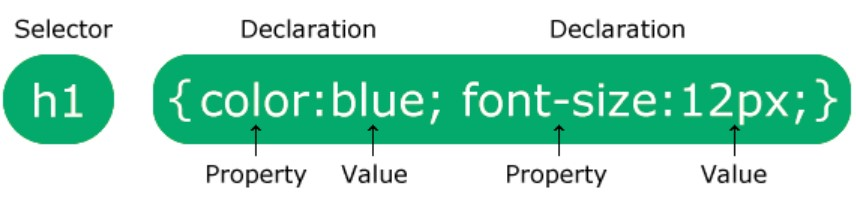
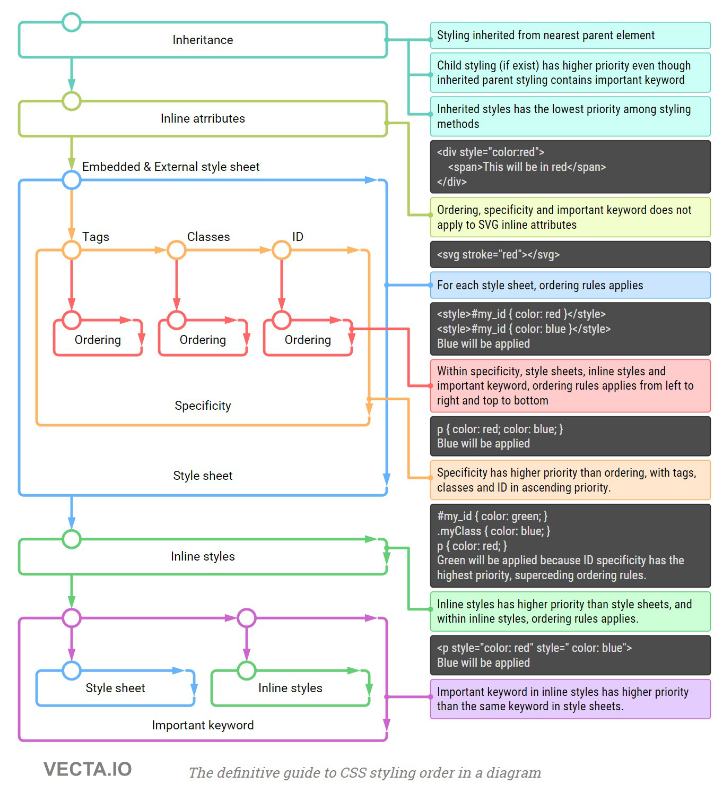

# CSS

1. [CSS](https://www.w3schools.com/css/css_intro.asp) - Cascading Style Sheets - it describes how HTML elements are to be displayed on screen, appear, or in other media. It can control multiple web pages at once. It can be implemented in HTML document itself or in external stylesheet file - `styles.css`
2. [CSS syntax](https://www.w3schools.com/css/css_syntax.asp) - 
**SELECTOR** - points the element you want to style. It can be: body, header, paragraph.  
**DECLARATION BLOCK** - contains 1 or more declarations separated by semicolon - `;`. Each declaration contains properties name and value, separated by colon - `:`.  
Multiple CSS declarations are separated with semicolons, and declaration blocks are surrounded by curly braces - `{}`. 
3. ***`/*...*/`*** - this is how you make comments in CSS document.
4. [Adding CSS to HTML](https://www.w3schools.com/CSS/css_howto.asp) - we have 3 ways to insert CSS:
    + **external CSS** - with external style sheet, you can change the look of an entire website by changing just one file. Each HTML page must include the `<link>` to style sheet. It should *not contain any HTML tags*. 
    + **Internal CSS** - it can be used if one single HTML page should have unique style. You use [`<style></style>`](https://www.w3schools.com/TAGs/tag_style.asp) tag in `<head>` element. 
    + **Inline CSS** - to apply a unique style for single element. *An inline style loses many of the advantages of a style sheet (by mixing content with presentation). Use this method sparingly*. 
5. [**Priority order**](https://vecta.io/blog/definitive-guide-to-css-styling-order) - when there are more styles used.  

    ***Lex specialis derogat legi generali***  
    General rules:
     + inline CSS (HTML style attribute) overrides CSS rules in style tag and CSS file 
     + a more specific selector takes precedence over a less specific one
    + rules that appear later in the code override earlier rules if both have the same specificity. 
    + A CSS rule with `!important` always takes precedence.
6. [`display`](https://developer.mozilla.org/en-US/docs/Web/CSS/display) - it is used to change display behavior of HTML element. Mainly we have 2:
    + `block` - **always** starts on new line and take the full width available (stretches out to the left and right as far as it can).
    + `inline` - only takes as much width as necessary. *It does not start a new line*.
    
    There are more `display` values.

7. [`margin`](https://www.w3schools.com/css/css_margin.asp) - are used to create space around elements, outside any defined borders. To shorten the code, it is possible to write all the margin properties in one line. TOP and BUTTON margin are sometimes collapsed into a single margin, that is equal to the largest of them - it is called [margin collapsing](https://developer.mozilla.org/en-US/docs/Web/CSS/CSS_Box_Model/Mastering_margin_collapsing).

    Examples:
    ``` CSS
    margin: 25px 50px;  /* This means taht: margin-top: 25px; margin-right: 50px; */
    margin: 25px 50px 25px;  /* This means taht: margin-top: 25px; margin-right: 50px; margin-buttom: 50px;*/
    margin: 25px;  /* This means taht all margins are 25px*/
    ``` 
    
    Margin properties list on default order- clockwise:
    + `margin-top`
    + `margin-right`
    + `margin-buttom`
    + `margin-left`  
    
    All margin properties can fave values:  
     + `auto` - browser calculates the margin
     + `lenght` - specifies a margin in pc, pt, cm, etc.
     + `%` - specifies a margin in % of the whole width of the containing element
     + `inherit` - specifies that the margin should be inherited from the parent element.
8. [`class`](https://developer.mozilla.org/en-US/docs/Web/HTML/Global_attributes/class) - is a *global attribute*. It is space separated list of case-sensitive classes of element. Classes allow CSS and JS to select and access specific elements via the [class selector](https://developer.mozilla.org/en-US/docs/Web/CSS/Class_selectors) or functions like the DOM method [`document.getElementsByClassName`](https://developer.mozilla.org/en-US/docs/Web/API/Document/getElementsByClassName).
9. [`class` selector](https://developer.mozilla.org/en-US/docs/Web/CSS/Class_selectors) - is represented by a dot symbol: ***`.`***. To create class we declare class by typing dot followed by name of this class. You can declare class for whole HTML document, page or specific element.  
Example of internal CSS: `.nameOfClass` and `class="nameOfClass` 
``` html
<!DOCTYPE html>
<html>
    <head>
        <style type="text/css">
            .nameOfClass
        {  
            text-align:center;
        }
        </style>                     
    </head>
    <body>
        <div class="nameOfClass">
            <h1>Education is different with Wikitechy</h1>
            <p>Wikitechy wants to reshape the education.</p>
        </div>
    </body>
</html>
 ```
10. centering with margins - we need 3 elements to achive that:
    + `display: block` - because it needs to control horizontal space
    + `width` - because we have to control it. For example, it can not be wider than browser, or to prevent from self expanding elements. 
    + `margin left/right: auto`  
    Example:
``` css
    display: block;
    width: 400px;
    margin-left: auto;
    margin-right: auto;
```
11. 233