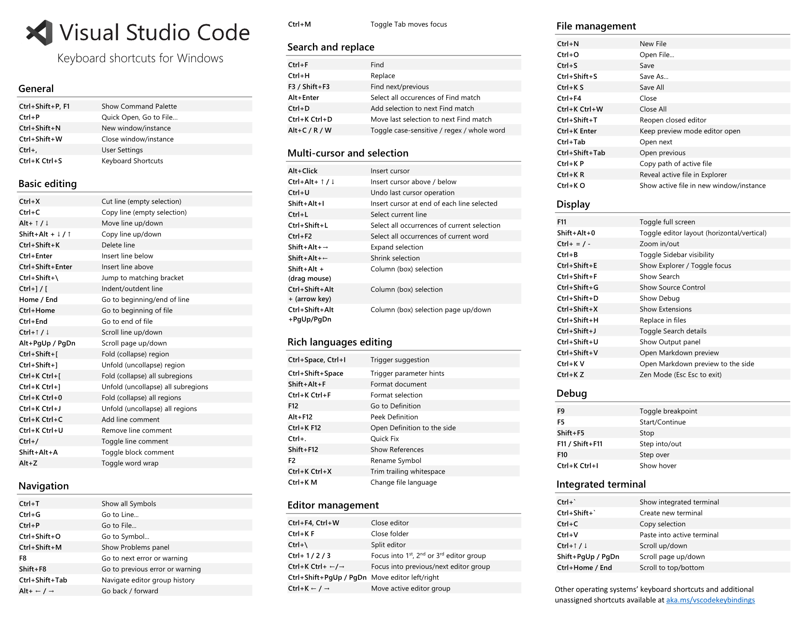

1. `Ctr + D` -  add to selection next same match
2. `Ctrl + Shift + L` - add to selection all same match
2. `Ctr + Alt` and pressing `arrow up` or `arrow down`- to select multiple lines for editing
3. `Shift + Alt` and pressing `arrow up` or `arrow down`- copy whole line 
4. `Ctrl + [ or ]` - select line or multiple lines and you can indent or unindent

