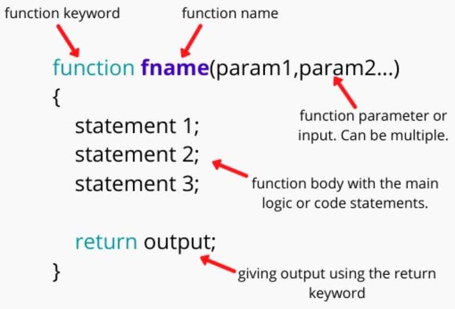

## Useful pages ## ##
1. https://javascript.info/hello-world
2. https://www.w3schools.com/js/default.asp
3. https://developer.mozilla.org/en-US/docs/Web/JavaScript/Data_structures
4. https://www.youtube.com/watch?v=PkZNo7MFNFg&t=4s
5. https://youtu.be/jS4aFq5-91M - maybe?

## JS ##  

1. `//` -  inline comment
2. `/* ... */` - multi line comment
3. [**JavaScript Data Types -  7 PRIMITIVES**](https://www.w3schools.com/js/js_datatypes.asp) - We have 7 primitives: **String**, **Number**, **Bigint**, **Boolean**, **Undefined**, **Null**, **Symbol**. 8-th is an **object** type.   When adding a number and a string, JavaScript will treat the number as a string. JS types are **dynamic*. This means that same variable can be used to hold different data types.   
JS 8 data types:  
    + [**String**](https://www.w3schools.com/js/js_strings.asp) - is a series of characters like "John Doe". Strings are written with quotes. You can use single '**a**' or double quotes "**a**". You can use quotes inside a string, as long as they don't match the quotes surrounding the string or you can exit literal quotes adding **`\`** before **`'` or `"`**. We can concatenate strings with `+` or with `+=`.  
    Example:
    ``` javascript
    var myStr = "This is the start. " + "This is the end.";
    var ourStr = "I come first. ";
    ourStr += "I come second.";
    -------------------------------- 
    var myName = "Martin";
    var ourStr = "Hello, our name is " + myName + ", how are you";
    --------------------------------
    var firstName = "Marcin"
    var sureName = " Martin"
    firstName += sureName
    ```

    + [**Number**](https://www.w3schools.com/js/js_numbers.asp) - All JavaScript numbers are stored as decimal numbers (double,64-bit floating point).Numbers can be written with, or without decimals.
    + [**Bigint**](https://www.w3schools.com/js/js_bigint.asp) - All JavaScript numbers are stored in a a 64-bit floating-point format. JavaScript BigInt is a new datatype (ES2020) that can be used to store integer values that are too big to be represented by a normal JavaScript Number.
    + [**Boolean**](https://www.w3schools.com/js/js_booleans.asp) - Booleans can only have two values: true or false.
    + **Undefined**
    + **Null** - set value to none
    + **Symbol**
    + **Object**, data type can contain: 
        + [**an array**](https://www.w3schools.com/js/js_arrays.asp) - JavaScript arrays are written with square brackets. Array items are separated by commas. The following code declares (creates) an array called cars, containing three items (car names):  
        Example
        ``` javascript
        const cars = ["Saab", "Volvo", "BMW"];
        ```
        Array indexes are zero-based, which means the first item is [0], second is [1], and so on.
        + **an object**
        + **a data**.  
4. [`Variable declaration`](https://www.w3schools.com/js/js_variables.asp) - can be declared in 4 ways:
    + automatically
    + [`var`]() - will be able to used in whole program.
    + [`let`](https://www.w3schools.com/js/js_let.asp) - used only in scope where you declared it. 
    + [`const`](https://www.w3schools.com/js/js_const.asp) - is variable that will never change. 

    |       | scope | Redeclare | Reassign | Hoisted | Binds this |
    | ----- | ----- | --------- | -------- | ------- | ---------- |
    | var   | NO    | YES       | YES      | YES     | YES        |
    | lest  | YES   | NO        | YES      | NO      | NO         |
    | const | YES   | NO        | NO       | NO      | NO         |

5. [`<script></script>`](https://www.w3schools.com/Tags/tag_script.asp)- is used to embed a clint-side script (JS). The `<script></script>` element either contains scripting statements or it points to an external file though the src attribute.  
**A single `<script>` tag can’t have both the src attribute and code inside.**  
    ``` javascript
    // the content is ignored, because src is set
    <script src="file.js">
      alert(1); 
    </script>
    // GOOD
    <script src="file.js"></script>
    <script>
      alert(1);
    </script>
    ```  


6. **declare** and **assign** - declare is to create a data object and give a name, so that you can reference it later in your code. To assign is to gie it a value.  
Example:
    ``` javascript
    // Declare "firstName" constant
    const firstName;
    
    // Assign it a value of "Jim"
    firstName = "Jim";
    ```  
7. **augmented math operations** -  
    + `myVar++` or `myVar--` - shorter increment or decrement
    + `a = a + 12;` shorter `a += 12;`
    + `a = a - 12;` shorter `a-=12;`
    + `a = a * 12;` shorter `a *= 12;`
    + `a = a / 12;` shorter `a /= 12;`  

8. **quoting in string** -  
    ``` javascript
    var myStr1 = "literal 'quote' test";
    var myStr2 = 'literal "quote" test';
    var myStr3 = "literal \"quote\" test";
    ```
    Output:  
    literal 'quote' test  
    literal "quote" test  
    literal "quote" test  
9. Other **string** shortcuts:  
    + `\\` - to put backslash and not exit string
    + `\n` - newline in string
    + `\r` - carriage return
    + `\t` - tab
    + `\b` - backspace
    + `\f` - form feed
10. `varName.length` - to find variable length
11. `varName[0]` - **bracket notation** will find first sign in variable. You can find other signs in string by putting deferent number position in brackets.
12. `varName[varName.length - 1];` - to find last symbol. This is for selecting position, not subtracting. You can find other signs in string by putting deferent number position in brackets.
13. **String Immutability** - means that you can NOT change single charakter in assigned string. You MUST assign whole new value.
    ``` javascript 
    var myStr = "Jello World"; 
    varStr[0] = "H"; // NOPE
    varStr = "Hello World";//DOPE
    ```
14. [**functions**](https://javascript.info/function-basics) - function is a block of code designed to perform a particular task. It is executed when "something" invokes it(call it). With functions you can reuse code. You can write code that can be used many times. You can use the same code with different arguments, to produce different results
    ``` javascript
    function worldBlanks(myNoun, myAdjective, myVerb, myAdverb) {
        var result = "";
        result += "The " + myAdjective + " " + myNoun + " " + myVerb + " to the store " + myAdverb
        return result;
    }
    console.log(worldBlanks("dog", "big", "ran", "quickly"))
    console.log(worldBlanks("bike", "pink", "ran", "slowly"))
    ```  

      

15. [**Arrays**](https://javascript.info/array) - to store ordered collections. To declare array we use keyword - `let`, `const`, `var`. Then name of array, and square brackets. You can put many different elements by separating them with `,`.  
We can have array in array, it is called **nested array or multidimensional array**.  
We can access array with **data index number**.  
We can modify data with index notation.  
We can add element from array - `.push()`.  
We can remove element from array - `.pop()`    
Example:
    ``` javascript
    var ourArray = ["John", 23];
    var ourArray = [["the universe", 42], ["everything", 101010]];
    // ARRAY ACCESS
    var ourArray = [50, 60, 70];
    var ourData = ourArray[0] // this will give us first position in array - 50
    // MULTI-DIMENSIONAL ARRAY ACCESS
    var myArray = [[1,2,3], [4,5,6], [7,8,9], [[10,11,12],13,14]];
    var myData = myArray[3] [0] [2]; // This will return number 12.
   
    
    
    ```
16. [`.pop()`](https://developer.mozilla.org/en-US/docs/Web/JavaScript/Reference/Global_Objects/Array/pop) - this method removes the last element from an array and returns  that element.  
    ``` javascript
    //.pop()
    var ourArray = [1, 2, 3];
    var removedFromOurArray = ourArray.pop()
    ```

17. [`.push()`](https://developer.mozilla.org/en-US/docs/Web/JavaScript/Reference/Global_Objects/Array/push) - this method adds the specified elements to the end of an array and returns the new length of the array.  
    ``` javascript
     // push()
    var ourArray = ["Simpson", "J", "cat"];
    ourArray.push(["happy", "joy"]); 
    // result: ["Simpson", "J", "cat", ["happy", "joy"]]
    ```
18.  [`.shift()`](https://www.w3schools.com/jsref/jsref_shift.asp) - this method removes tha first item of an array, changes the original array, returns shifted element from array.  
     ``` javascript
     // .shift() function
     var ourArray = ["Simpson", "J", ["cat"]];
     var removedFromOurArray = ourArray.shift();
     ```
22. [`.unshift`](https://developer.mozilla.org/en-US/docs/Web/JavaScript/Reference/Global_Objects/Array/unshift) - this method adds elements to the beginning of an array.  
    ``` javascript
    var ourArray = ["Simpson", "J", "cat"];
    ourArray.shift(); // removes "Simpson"
    ourArray.unshift("Happy");
    result: ["Happy", "J", "cat"]
    ```
20. **Putting values to functions with arguments**  
    Example:
    ``` javascript
    function ourFunctionWithArgs (a, b) {
        console.log(a-b);
    }
    ourFunctionWithArgs(10,5); //output 5
    ```
21. **Types of Scope** - refers to visibility of variables. We indicate 3 types:  
    + **block scope** - Variables declared with `let` and `const`  provide block scope. Variables declared with `var` can **NOT** have block scope. Variables declared inside `{}` can be accessed from outside the block. 
    + **function scope** - local scope - it is limited to block of code, function or conditional statement in which it is defined. 
    + **global scope** - means that they can be seen in whole code. If you assign a value to a variable that has not been declared, it will automatically become a **GLOBAL** variable.  
    In `Strict Mode`, undeclared variables are **not** automatically global
22. [`return`](https://developer.mozilla.org/en-US/docs/Web/JavaScript/Reference/Statements/return) - this statement ends function and specifies a value to be returned to the function caller. It can be used only within function bodies. 
23. [**DOM**](https://www.w3schools.com/js/js_htmldom.asp) - Document Object Model - how you use JavaScript to modify a website.
24. [`; - semicolon`](https://www.codecademy.com/resources/blog/your-guide-to-semicolons-in-javascript/)
25. `===` - is equal? Not declaration. It is more strict than `==`
26. [`.getElementById()`](https://developer.mozilla.org/en-US/docs/Web/API/Document/getElementById) - one of document methods. Returns element with specified value. 
27. [`.querySelector`](https://developer.mozilla.org/en-US/docs/Web/API/Document/querySelector) -  
Example:
    ``` javascript
    // If in HTML we have id we use #
    let sumEl = document.querySelector("#sum-el")
    // If in HTML we have class we use .
    let sumEl = document.querySelector(".sum-el")
    ```  
28. [`for loop`](https://www.w3schools.com/js/js_loop_for.asp) - loops can execute a block of code a number of times. It is common to use variable name `i = ...` for counting.  
JavaScript supports different kinds of loops:  
    + for - loops through a block of code a number of times
    + for/in - loops through the properties of an object
    + for/of - loops through the values of an iterable object
    + while - loops through a block of code while a specified condition is true
    + do/while - also loops through a block of code while a specified condition is true  
    Example:
        ``` javascript
        //(expression1; expression 2; expression3) 
        for (let count = 1; count< 11; count += 1 ) {
        console.log(count)
        }
        ```
        *Expression 1* is executed (one time) before the execution of the code block.  
        *Expression 2* defines the condition for executing the code block.  
        *Expression 3* is executed (every time) after the code block has been executed.  
        
29. **Loops and array**
    ``` javascript
    let message = [
        "Hey, how's it going",
        "I'm great, thank you! How about you?",
        "All good. Been working on my portfolio lately.",
        "Same here!",
        "Great to hear",
        "Yes!"
    ]

    for (let i = 0; i < message.length; i += 1) {
        console.log(message[i])
    }
    ```
30. [`Math.`](https://developer.mozilla.org/en-US/docs/Web/JavaScript/Reference/Global_Objects/Math)
    + [**`Math.random`**](https://developer.mozilla.org/en-US/docs/Web/JavaScript/Reference/Global_Objects/Math/random) -  for getting rondom numbers.  
    Examples:
    ``` javascript
    Math.random() // returns number < 0
    Math.random() * 10 // returns number from 0 - 9
    Math.random() * 11 // returns number from 0 - 10
    Math.random() * 10 // returns number from 0 - 9
    ```
    + [`Math.floor`](https://developer.mozilla.org/en-US/docs/Web/JavaScript/Reference/Global_Objects/Math/floor) - rounds down the largest integer.  
    Example:
    ``` javascript
    let a = Math.floor(Math.random() * 10)
    ```  

31. [**Logical operators**](https://javascript.info/logical-operators) - we can set apart 4 logical operators:
    + `||` - "or"
    + `&&` - "and"
    + `!` - "not"
    + [`??`](https://javascript.info/nullish-coalescing-operator) -  nullish coalescing operator  
44. [**Objects**](https://javascript.info/object) -  We can have empty object - empty cabinet.  
Object can have function in it called **object method**. Methods are actions that can be performed on objects. 
    Example:
    ``` javascript
    let user = {
        name: "John", // by key "name" store value "John"
        age: 30       // by key "age" store value 30
    }
    // EMPTY CABINET
    let user = new Object() // "object constructor" syntax
    //or
    let user = {} // "object literal" syntax
    // OBJECT METHOD

    ```


---------------------------------
https://youtu.be/PkZNo7MFNFg - skonczone na "Stand in line" 1:05:57