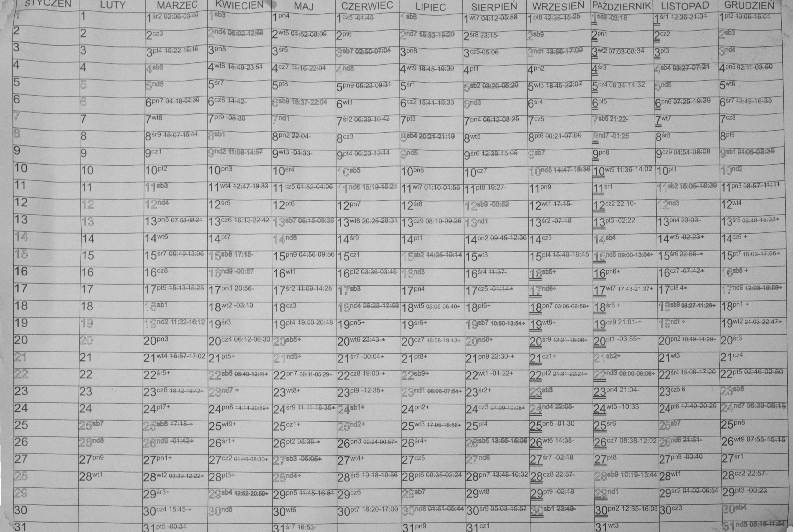

# Notatnik
## IDE

# Plan działania
1. [x] Wybór IDE - Visual Code Studio 
2. Nauka i wprowadzenie do obłsługi VCS
    + [x] tworzenie dokumentacji - https://www.markdownguide.org/getting-started/
    + [x] tutoriale  VCS: https://code.visualstudio.com/docs/getstarted/introvideos 
    + [x] Nauka Gita i GitHub
4. [x] Testy techniki pomodoro
5. Jak zacząć aplikacje
   + [x] node.js zainstalowany
   + [x] Hellow wordl w VSC
   + [ ] Nauka node.js
      + [ ] JavaScript
       

# Aplikacja Kalendarz - technologie
1.	Generujemy PDF po stronie serwera/backendu
Wtedy na backendzie może się to dziać na zasadzie wygenerowania bitmapy i w jej określonych miejscach umieszczasz tekst (daty) i ewentualnie jakieś obrazy dodatkowe
2.	Interfejs/API – z tego będzie korzystać część fronendoa. Kotlin for WebAssembly -> Kotlin Wasm. 

# Funkcjonalności
## Kalendarz

1. Kalendarz jest typu 365 dni. Czyli pokazuje wszystkie dni roku na jednej stronie
2. Poszczególne miesiące wyświetlają się od 1 do ostatniego, od lewej do prawej, poziomo. W równej lini 
3. Poszczególne dni każdego miesiąca wyświatlają sie od 1 do ostatniego dnai miesiąca, kolejno od góry do dołu. Każdy dzień to osobne pole w formie komórki.
4. ZawartoŚć komórki:
   + odpowiedni dzień miesiąca: 1-31
   + oznaczenie dnia tygodnia: Pon-Nie
   + odpowiednia ilość miejsca aby urzytkownik mógł poczynić notatkę
   + oznaczenie numerologiczne: 1-9
5. Możliwość ustawiania przez urzytkownika wielkości komórek. Ale wszystkie kórki mają być tej samej wielkości
6. Kalenarz ma być w formie PDF, do druku.
7. Czarno biały lub kolorowy (dodatkowa opłata)
8. Mozliwośc dodania loga przez klienta

## Strona
1. Płatności
   + kartą
   + BLIKime
   + PayPal
2. Pobieranie wygererowanego kalendarza przez klienta
3. Możliwość zakupienia jako gość. Tylko płatność i pobranie pliku PDF
4. Możliwość założenia konta, które oferuje dodatkowe funkcjonoalności
   + Dane potrzebne do założenia konta:
     - adres email
     - imie i nazwisko
     - data urodzenia
   + przypomnienie o zakupie nowefgo kalendarza przed końcem roku
5. Subskrybcja
    + automatyczne roczne odnawianie
    + dla jednej lub wielu osób
    + czy udzielać rabatu na opłąty z góry na kila lat do przodu?

## Zabezpieczenia
1. Czy warto zabezpieczyć pojedyńczą kopię przed udostepnianiem innym?
2. Czy da się zabezpieczyć przed kopiowaniem?
3. Może warto zrobić cenę bardzo niską, na tyle aby ludiom nie przychodziło do głowy żeby nie zapłacić. Dotego prosty proces płatności. Tak żeby nikomu się nie opłacało i było wręcz głupio nie zapłacic. 
4. 

